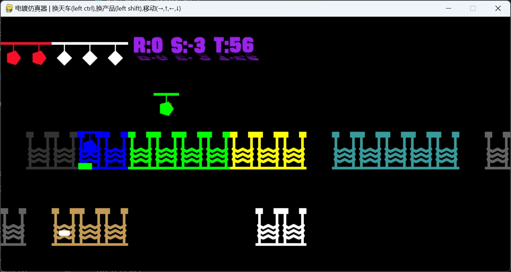

# 电镀强化学习仿真环境


## 安装

``` python
pip install -r requirements
```
## 配置

- 全局参数在 config/args.yaml
- 生产数据在 config/demo 目录

## 运行
### 自动上料demo

``` python
python play_auto.py
```
### 手工上料demo

``` python
python play_manual_control.py
```


